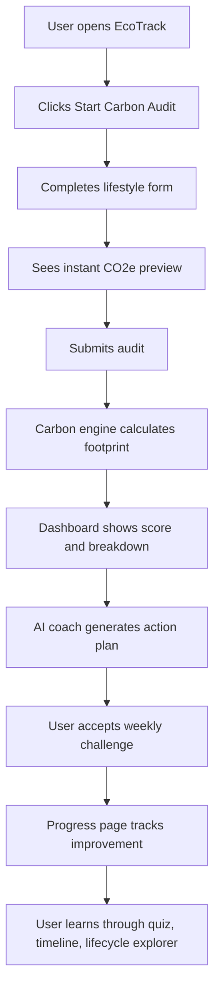

# 🌱 EcoTrack — AI Carbon Footprint Tracker, Coach & Climate Learning Platform

> **A competition-ready sustainability web app that helps users understand, track, and reduce their carbon footprint through simple lifestyle inputs, visual dashboards, gamified progress, climate education, and personalized AI-powered action plans.**

<p align="center">
  
  
  
  
  
</p>

---

## 🔗 Project Links

> Replace these before final submission.

| Resource | Link |
|---|---|
| Live Demo | `https://your-live-demo-url` |
| Demo Video | `https://your-demo-video-url` |
| Source Code | `https://github.com/your-username/ecotrack` |
| Pitch Deck | `https://your-pitch-deck-url` |
| Cloud Run URL | `https://your-cloud-run-service-url` |

---

## ⚡ One-Line Pitch

**EcoTrack turns carbon awareness into daily action by calculating a user’s footprint, explaining the biggest impact areas, and using AI to generate realistic, personalized reduction plans.**

---

## 🏆 Competition Summary

Most carbon calculators stop after showing a number. EcoTrack goes further:

```txt
Traditional calculator:
Input → CO2 number → User leaves

EcoTrack:
Input → Insight → AI action plan → Challenge → Progress → Habit
```

EcoTrack is built to impress judges because it combines:

- A practical carbon footprint calculator
- Personalized AI coaching
- Visual analytics
- Gamified habit-building
- Climate education
- Privacy-first demo mode
- Google Cloud-ready production architecture
- Clear implementation instructions for AI builders like Antigravity

---

## 🧭 Antigravity Build Brief

Use this README as the **single source of truth** for implementation.

### Build the project as

```txt
Frontend: React + Vite + TypeScript + Tailwind CSS
Backend: FastAPI + Python + Pydantic
State: Zustand + Zustand Persist/localStorage for demo mode
Charts: Recharts or Chart.js
AI: Backend-based Gemini/Vertex AI integration with mock fallback
Cloud: Optional Google Cloud Run + Firestore + Vertex AI + Logging + Monitoring
```

### Do not build it as

```txt
Next.js app
Frontend-only Gemini API key app
Authentication-first product
Blockchain/carbon-credit marketplace
Complex enterprise admin dashboard first
Only a chatbot
Only a static landing page
```

### Main build rule

The app must be fully demoable even without Google Cloud credentials.

When cloud variables are missing, EcoTrack should still support:

- Carbon calculator
- Real-time footprint preview
- Dashboard
- Local audit history
- Mock AI coach
- Demo data button
- Progress tracking
- Quiz
- Climate timeline
- Lifecycle explorer

---

## ✅ Build Priorities

Build in this order so the project becomes usable early.

| Priority | Feature | Required for Demo? | Why It Matters |
|---|---|---:|---|
| P0 | Landing page | Yes | Gives judges instant clarity |
| P0 | Carbon audit form | Yes | Core user input |
| P0 | Real-time carbon preview | Yes | Makes the app feel interactive |
| P0 | Carbon calculation engine | Yes | Core logic |
| P0 | Dashboard cards | Yes | Shows results clearly |
| P0 | Category breakdown chart | Yes | Visual impact |
| P0 | Demo/local mode | Yes | Reliable judging experience |
| P0 | Mock AI recommendations | Yes | Works without cloud |
| P1 | AI coach chat page | Yes | Innovation layer |
| P1 | Progress history | Yes | Shows behavior change |
| P1 | Weekly challenge | Yes | Habit-building |
| P1 | Badges/streaks | Yes | Engagement |
| P1 | Climate quiz | Yes | Education layer |
| P2 | Lifecycle explorer | Recommended | Differentiates the app |
| P2 | Climate timeline | Recommended | Adds awareness value |
| P2 | Vertex AI Gemini backend integration | Recommended | Production AI |
| P2 | Firestore persistence | Recommended | Cloud data storage |
| P2 | Cloud Run deployment | Recommended | Scalable deployment |
| P3 | Receipt scanning | Future | Advanced innovation |
| P3 | Maps commute estimation | Future | Better transport accuracy |
| P3 | Smart meter import | Future | Better energy accuracy |
| P3 | College/team leaderboard | Future | Community impact |

---

## 🚨 Problem Statement

Climate change is a global challenge, but personal climate action often feels confusing, abstract, and difficult to maintain.

Users face five major problems:

| Problem | User Pain |
|---|---|
| No clear starting point | People do not know which activities to measure. |
| Generic advice | Most climate tips are not personalized to actual lifestyle data. |
| No progress feedback | Users lose motivation when they cannot see improvement. |
| Low climate literacy | People may not understand how everyday products and habits create emissions. |
| Guilt-heavy communication | Fear or shame-based messaging makes users avoid the topic. |

EcoTrack solves these problems with a simple audit, clear visual feedback, practical AI recommendations, and habit-building features.

---

## 💡 Solution Overview

EcoTrack helps users estimate emissions from:

- Transport
- Diet
- Electricity
- Shopping / lifestyle consumption
- Flights

Then EcoTrack provides:

- Monthly CO2e estimate
- Yearly CO2e estimate
- Eco score out of 100
- Category-wise emission breakdown
- Highest-emission category detection
- Personalized AI action plan
- Weekly challenge
- Progress charts
- Badges and streaks
- Climate quiz
- Climate timeline
- Lifecycle explorer

---

## 🎯 Chosen Vertical

**Personal Sustainability Assistant**

EcoTrack focuses on individual action by making climate decisions measurable, practical, and motivating.

---

## 👥 Target Users

| User Group | Use Case |
|---|---|
| Students | Learn sustainability and build habits early. |
| Urban professionals | Understand commute, electricity, food, and shopping impact. |
| Families | Track household-level sustainability improvements. |
| College eco clubs | Run awareness campaigns and weekly challenges. |
| Competition judges | Evaluate a complete AI + cloud + impact solution. |

---

## 🧑‍💻 Core User Journey



---

## 🏗️ System Architecture

EcoTrack supports two modes:

| Mode | Purpose | Storage | AI |
|---|---|---|---|
| Demo / Local Mode | Judging and development reliability | Browser localStorage/Zustand persist | Rule-based mock AI |
| Cloud Mode | Production-ready deployment | Firestore | Vertex AI Gemini via backend |

```txt
┌─────────────────────────────────────────────────────────────┐
│                         User Browser                        │
│ React + Vite + TypeScript + Tailwind CSS                    │
│ Landing · Audit · Dashboard · Coach · Progress · Education   │
└──────────────────────────────┬──────────────────────────────┘
                               │ API calls / local fallback
                               ▼
┌─────────────────────────────────────────────────────────────┐
│                         FastAPI Backend                     │
│ Validation · Carbon Engine · AI Orchestration · Persistence  │
│ /api/health · /api/audit · /api/chat · /api/history          │
│ /api/challenge                                               │
└──────────────┬───────────────────────────┬──────────────────┘
               │                           │
               ▼                           ▼
┌────────────────────────┐       ┌────────────────────────────┐
│ Local / Firestore Data │       │ Mock AI / Vertex AI Gemini  │
│ Audit history          │       │ Personalized coaching       │
│ Challenges             │       │ Action plan generation      │
└────────────────────────┘       └────────────────────────────┘
               │
               ▼
┌─────────────────────────────────────────────────────────────┐
│ Optional Google Cloud Production Layer                      │
│ Cloud Run · Firestore · Vertex AI · Cloud Build              │
│ Logging · Monitoring · Trace · Secret Manager               │
└─────────────────────────────────────────────────────────────┘
```

---

# ✨ Feature Specification

## 1. Landing Page

The landing page should make the app understandable in 5 seconds.

### Must include

- Hero headline
- Short explanation
- “Start Carbon Audit” button
- “Try Demo Data” button
- Three benefit cards
- Dashboard preview placeholder
- Privacy/methodology links
- Mobile-friendly layout

### Suggested hero copy

```txt
Track your footprint. Reduce it with AI.
```

### Suggested subtext

```txt
EcoTrack helps you calculate your carbon footprint, discover your biggest impact areas, and build sustainable habits through personalized AI recommendations.
```

### Benefit cards

| Card | Copy |
|---|---|
| Measure | Estimate your monthly and yearly footprint in minutes. |
| Understand | See which lifestyle category creates the most impact. |
| Improve | Get practical AI-powered actions you can start this week. |

---

## 2. Carbon Audit Form

The audit form is the core product experience.

### Inputs

| Field | Type | Example | Required |
|---|---|---|---:|
| Transport mode | Select | Car, Bus, Train/Metro, Bike, Walk | Yes |
| Travel distance | Number | 120 km/week | Yes |
| Diet type | Select | Vegan, Vegetarian, Omnivore, Meat-heavy | Yes |
| Electricity usage | Number | 180 kWh/month | Yes |
| Shopping level | Select | Low, Medium, High | Yes |
| Flight distance | Number | 0 km/month | No |
| Household size | Number | 1 | No |

### Validation rules

- No negative values
- Travel distance must be realistic
- Electricity usage must be realistic
- Household size must be at least 1
- Missing required fields show friendly messages
- Form should be usable on mobile

---

## 3. Real-Time Carbon Preview

The frontend should calculate an instant preview before submission.

### Preview should show

- Estimated monthly CO2e
- Estimated yearly CO2e
- Highest category
- Short insight message

Example:

```txt
Your current estimate is 403 kg CO2e/month. Electricity is your biggest category, so energy-saving actions may help the most.
```

### Important implementation detail

The frontend preview and backend final calculation should use the same emission factor values.

Recommended shared structure:

```txt
frontend/src/lib/emissionFactors.ts
backend/services/emission_factors.py
```

---

## 4. Dashboard

The dashboard should make the result visual and motivating.

### Dashboard cards

- Monthly footprint
- Yearly footprint
- Eco score
- Highest category
- Biggest improvement opportunity
- Best habit already working

### Charts

Use Recharts or Chart.js.

Recommended charts:

- Donut chart for category breakdown
- Line chart for progress history
- Bar chart for action impact

### Dashboard message examples

```txt
Great start! Your biggest improvement opportunity is electricity.
```

```txt
Your transport impact is already low. Keep that habit going.
```

---

## 5. AI Sustainability Coach

The AI coach should act as a friendly sustainability guide.

### User can ask

- “How can I reduce my footprint this week?”
- “What can I do without spending money?”
- “Which category should I focus on first?”
- “Can you give me a 7-day action plan?”
- “What habits am I already doing well?”

### AI must use

- Latest footprint data
- Highest-emission category
- Category breakdown
- User’s question
- Friendly and beginner-safe tone

### AI must avoid

- Guilt-based wording
- Fear-heavy climate messaging
- Extreme lifestyle instructions
- False precision
- Asking for sensitive personal data

---

## 6. Mock AI Fallback

EcoTrack must work even when Gemini/Vertex AI is unavailable.

### Fallback logic

| Highest Category | Mock Recommendation |
|---|---|
| Transport | Try public transport, carpooling, cycling, walking, or reducing unnecessary trips. |
| Electricity | Reduce AC usage, switch off standby devices, use LED bulbs, and use natural light. |
| Diet | Add more plant-based meals and reduce high-emission foods gradually. |
| Shopping | Buy fewer non-essential items, repair before replacing, and choose durable products. |
| Flights | Replace short flights with train/bus when practical and combine trips. |

### Mock response example

```txt
Your biggest opportunity is electricity. This week, try switching off standby devices, reducing AC usage by 1 hour per day, and using natural light when possible. These actions are free and easy to start.
```

---

## 7. Action Wizard

The Action Wizard converts recommendations into a roadmap.

Each action card should include:

| Field | Example |
|---|---|
| Title | Reduce AC usage by 1 hour per day |
| Category | Electricity |
| Impact | Medium |
| Difficulty | Easy |
| Estimated saving | 5–10 kg CO2e/month |
| Cost | Free |
| Timeframe | This week |

Actions should be grouped into:

- Quick wins
- Medium-effort actions
- High-impact upgrades

---

## 8. Progress Tracking

Progress tracking should make users return.

### Include

- Audit history
- Monthly trend chart
- Personal best score
- Improvement percentage
- Completed challenges
- Streak count
- Shareable progress card

### Local mode behavior

Use:

```txt
Zustand persist or localStorage
```

### Cloud mode behavior

Use:

```txt
Firestore
```

---

## 9. Gamification

Gamification should be motivational but not childish.

### Include

- Eco score out of 100
- Weekly challenge
- Streaks
- Badges
- Milestone messages
- Completed action cards

### Example badges

| Badge | Unlock Condition |
|---|---|
| Transit Hero | Complete a transport reduction challenge |
| Energy Saver | Complete an electricity-saving challenge |
| Low Waste Week | Complete a shopping/waste challenge |
| Plant Plate Starter | Choose a plant-based action |
| Consistency Champion | Complete 3 audits |
| Climate Learner | Finish the quiz |

---

## 10. Climate Knowledge Quiz

The quiz makes EcoTrack educational.

### Quiz requirements

- 5 to 10 questions
- Multiple-choice format
- Score result
- Correct answer explanation
- Encouraging feedback

### Topics

- Carbon footprint basics
- Transport emissions
- Food emissions
- Electricity use
- Waste reduction
- Climate myths vs facts

---

## 11. Climate Timeline

The timeline explains major climate milestones.

Each item should have:

- Year
- Title
- Short explanation
- Optional icon

Example items:

- Early climate science discoveries
- Renewable energy growth
- Paris Agreement
- Electric mobility adoption
- Net-zero goals
- Local sustainability movements

---

## 12. Lifecycle Explorer

The Lifecycle Explorer shows where emissions come from in everyday products.

### Products to include

- T-shirt
- Smartphone
- Burger
- Plastic bottle
- Jeans
- Laptop

### Stages

- Raw materials
- Manufacturing
- Transport
- Usage
- Disposal/recycling

Example insight:

```txt
A T-shirt's footprint is not only from washing. Cotton farming, dyeing, manufacturing, and shipping also contribute to its total impact.
```

---

## 13. Judge-Friendly Demo Mode

Demo mode should make the app easy to evaluate.

### Include

- “Try Demo Data” button
- Pre-filled sample values
- Mock history records
- Mock AI response
- Demo mode banner
- No sign-in required
- No cloud credential requirement

### Sample demo values

| Field | Value |
|---|---|
| Transport | Car |
| Distance | 120 km/week |
| Diet | Vegetarian |
| Electricity | 180 kWh/month |
| Shopping | Medium |
| Flights | 0 km/month |
| Household size | 1 |

---

# 🧮 Carbon Calculation Methodology

EcoTrack uses transparent, configurable emission factors.

> These values are simplified MVP estimates for awareness and education. They are not official carbon accounting certification values.

## Formula

```txt
Transport CO2e = weekly distance × transport factor × 4
Electricity CO2e = monthly kWh × electricity factor
Diet CO2e = diet monthly baseline
Shopping CO2e = shopping monthly baseline
Flights CO2e = monthly flight km × flight factor

Total Monthly CO2e = Transport + Electricity + Diet + Shopping + Flights
Yearly CO2e = Total Monthly CO2e × 12
```

## Default emission factors

| Category | Input | Factor / Baseline |
|---|---:|---:|
| Car | km/week | 0.21 kg CO2e/km |
| Bus | km/week | 0.089 kg CO2e/km |
| Train / Metro | km/week | 0.041 kg CO2e/km |
| Bike / Walk | km/week | 0 kg CO2e/km |
| Flight | km/month | 0.255 kg CO2e/km |
| Vegan diet | monthly | 55 kg CO2e |
| Vegetarian diet | monthly | 85 kg CO2e |
| Omnivore diet | monthly | 150 kg CO2e |
| Meat-heavy diet | monthly | 230 kg CO2e |
| Electricity | kWh/month | 0.82 kg CO2e/kWh |
| Shopping low | monthly | 30 kg CO2e |
| Shopping medium | monthly | 70 kg CO2e |
| Shopping high | monthly | 130 kg CO2e |

---

## Eco Score Logic

Eco score should be simple and encouraging.

| Monthly CO2e | Score Range | Message |
|---:|---:|---|
| 0–250 kg | 90–100 | Excellent low-impact lifestyle |
| 251–500 kg | 70–89 | Good start with clear improvement options |
| 501–800 kg | 50–69 | Moderate footprint with useful action areas |
| 801–1200 kg | 30–49 | High footprint with major opportunities |
| 1200+ kg | 0–29 | Very high footprint; focus on one category first |

Example explanation:

```txt
Your score is 72. You are doing well in diet, and your biggest opportunity is electricity. Small energy-saving actions can improve your score next month.
```

---

## Example Calculation

Input:

```json
{
  "transport": { "mode": "car", "kmPerWeek": 120 },
  "diet": "vegetarian",
  "electricityKwhPerMonth": 180,
  "shoppingLevel": "medium",
  "flightKmPerMonth": 0
}
```

Calculation:

```txt
Transport = 120 × 0.21 × 4 = 100.8 kg CO2e/month
Diet = 85 kg CO2e/month
Electricity = 180 × 0.82 = 147.6 kg CO2e/month
Shopping = 70 kg CO2e/month
Flights = 0 kg CO2e/month

Total = 403.4 kg CO2e/month
Yearly = 403.4 × 12 = 4840.8 kg CO2e/year
Highest category = Electricity
Suggested score = 72
```

---

# 🧠 AI Design

## AI Role

EcoTrack AI is a **sustainability coach**, not a generic chatbot.

It helps users answer:

- What should I improve first?
- What can I do this week?
- What can I do without spending money?
- Which habits are already good?
- What is the easiest action for me?

---

## Production AI Flow

```txt
Frontend → POST /api/chat → FastAPI → Vertex AI Gemini → FastAPI → Frontend
```

Private AI credentials must remain on the backend.

---

## AI Prompt Template

```txt
You are EcoTrack Coach, a friendly sustainability assistant.

Use the user's latest carbon footprint data to suggest practical actions.

User footprint:
- Monthly CO2e: {monthlyKgCO2e}
- Yearly CO2e: {yearlyKgCO2e}
- Eco score: {score}
- Highest category: {highestCategory}
- Breakdown: {breakdown}
- User message: {message}

Rules:
1. Be encouraging and non-judgmental.
2. Recommend 3 to 5 realistic actions.
3. Prioritize the highest-emission category.
4. Include estimated impact if possible.
5. Include difficulty and cost when useful.
6. Avoid fear-based or guilt-based language.
7. Do not claim exact scientific certainty.
8. Keep the answer beginner-friendly.
9. Do not ask for sensitive personal data.
10. If data is missing, state the assumption simply.
```

---

## AI Response Format

Prefer structured responses:

```json
{
  "summary": "Your biggest opportunity is electricity.",
  "actions": [
    {
      "title": "Switch off standby devices",
      "category": "electricity",
      "impact": "medium",
      "difficulty": "easy",
      "estimatedKgCO2eSaved": 5,
      "cost": "free",
      "timeframe": "this week"
    }
  ],
  "encouragement": "Start with one small action and track again next week."
}
```

---

# 🔌 API Contract

## `GET /api/health`

Checks backend status.

Response:

```json
{
  "status": "ok",
  "mode": "demo",
  "version": "1.0.0"
}
```

---

## `POST /api/audit`

Calculates and stores a carbon audit.

Request:

```json
{
  "sessionId": "demo-user-123",
  "transport": {
    "mode": "car",
    "kmPerWeek": 120
  },
  "diet": "vegetarian",
  "electricityKwhPerMonth": 180,
  "shoppingLevel": "medium",
  "flightKmPerMonth": 0,
  "householdSize": 1
}
```

Response:

```json
{
  "recordId": "audit_123",
  "monthlyKgCO2e": 403.4,
  "yearlyKgCO2e": 4840.8,
  "score": 72,
  "highestCategory": "electricity",
  "breakdown": {
    "transport": 100.8,
    "diet": 85,
    "electricity": 147.6,
    "shopping": 70,
    "flights": 0
  },
  "topActions": [
    "Reduce electricity use by 10% this month",
    "Shift 2 commute days to public transport",
    "Choose one no-buy week for non-essential shopping"
  ],
  "mode": "demo"
}
```

---

## `POST /api/chat`

Generates AI coaching response.

Request:

```json
{
  "sessionId": "demo-user-123",
  "message": "How can I reduce my footprint this week without spending money?",
  "latestFootprint": {
    "monthlyKgCO2e": 403.4,
    "yearlyKgCO2e": 4840.8,
    "score": 72,
    "highestCategory": "electricity",
    "breakdown": {
      "transport": 100.8,
      "diet": 85,
      "electricity": 147.6,
      "shopping": 70,
      "flights": 0
    }
  }
}
```

Response:

```json
{
  "reply": "Your biggest opportunity is electricity. This week, try switching off standby devices, reducing AC use by 1 hour per day, and using natural light during daytime.",
  "actions": [
    {
      "title": "Switch off standby devices",
      "category": "electricity",
      "impact": "medium",
      "difficulty": "easy",
      "estimatedKgCO2eSaved": 5,
      "cost": "free"
    }
  ],
  "source": "mock"
}
```

---

## `GET /api/history`

Returns previous audits.

Query:

```txt
/api/history?sessionId=demo-user-123
```

Response:

```json
{
  "records": [
    {
      "recordId": "audit_123",
      "createdAt": "2026-06-19T10:00:00Z",
      "monthlyKgCO2e": 403.4,
      "yearlyKgCO2e": 4840.8,
      "score": 72,
      "highestCategory": "electricity"
    }
  ]
}
```

---

## `POST /api/challenge`

Generates a weekly challenge.

Response:

```json
{
  "challengeId": "challenge_123",
  "title": "Energy Saver Week",
  "description": "Reduce AC usage by 1 hour daily and switch off standby devices.",
  "category": "electricity",
  "estimatedImpactKg": 8,
  "difficulty": "easy",
  "completed": false
}
```

---

## `PATCH /api/challenge/{challengeId}`

Marks a challenge complete.

Request:

```json
{
  "completed": true
}
```

Response:

```json
{
  "challengeId": "challenge_123",
  "completed": true
}
```

---

# 🗃️ Data Models

## TypeScript Types

```ts
export type TransportMode = "car" | "bus" | "train" | "bike" | "walk";
export type DietType = "vegan" | "vegetarian" | "omnivore" | "meat-heavy";
export type ShoppingLevel = "low" | "medium" | "high";
export type CarbonCategory =
  | "transport"
  | "diet"
  | "electricity"
  | "shopping"
  | "flights";

export type CarbonAuditInput = {
  sessionId: string;
  transport: {
    mode: TransportMode;
    kmPerWeek: number;
  };
  diet: DietType;
  electricityKwhPerMonth: number;
  shoppingLevel: ShoppingLevel;
  flightKmPerMonth?: number;
  householdSize?: number;
};

export type FootprintBreakdown = {
  transport: number;
  diet: number;
  electricity: number;
  shopping: number;
  flights: number;
};

export type FootprintRecord = {
  recordId: string;
  sessionId: string;
  createdAt: string;
  monthlyKgCO2e: number;
  yearlyKgCO2e: number;
  score: number;
  highestCategory: CarbonCategory;
  breakdown: FootprintBreakdown;
  inputs: CarbonAuditInput;
  topActions: string[];
};

export type ChallengeRecord = {
  challengeId: string;
  sessionId: string;
  title: string;
  description: string;
  category: CarbonCategory;
  estimatedImpactKg: number;
  difficulty: "easy" | "medium" | "hard";
  completed: boolean;
};
```

---

## Firestore Collections

Use Firestore only in cloud mode.

```txt
footprints/{recordId}
├── sessionId: string
├── createdAt: timestamp
├── monthlyKgCO2e: number
├── yearlyKgCO2e: number
├── score: number
├── highestCategory: string
├── inputs: object
├── breakdown: object
└── topActions: array

challenges/{challengeId}
├── sessionId: string
├── weekStart: timestamp
├── title: string
├── description: string
├── category: string
├── estimatedImpactKg: number
├── difficulty: string
└── completed: boolean

chats/{chatId}
├── sessionId: string
├── createdAt: timestamp
├── userMessage: string
├── aiResponse: string
└── footprintContext: object
```

---

# 🗂️ Recommended Project Structure

```txt
ecotrack/
├── frontend/
│   ├── src/
│   │   ├── components/
│   │   │   ├── layout/
│   │   │   │   ├── Navbar.tsx
│   │   │   │   ├── Footer.tsx
│   │   │   │   └── DemoModeBanner.tsx
│   │   │   ├── audit/
│   │   │   │   ├── CarbonAuditForm.tsx
│   │   │   │   └── CarbonPreview.tsx
│   │   │   ├── dashboard/
│   │   │   │   ├── DashboardCards.tsx
│   │   │   │   ├── BreakdownChart.tsx
│   │   │   │   └── ActionCard.tsx
│   │   │   ├── coach/
│   │   │   │   └── CoachChat.tsx
│   │   │   ├── progress/
│   │   │   │   ├── ProgressChart.tsx
│   │   │   │   ├── BadgeGrid.tsx
│   │   │   │   └── ChallengeCard.tsx
│   │   │   └── education/
│   │   │       ├── QuizCard.tsx
│   │   │       ├── TimelineItem.tsx
│   │   │       └── LifecycleStage.tsx
│   │   ├── pages/
│   │   │   ├── LandingPage.tsx
│   │   │   ├── AuditPage.tsx
│   │   │   ├── DashboardPage.tsx
│   │   │   ├── CoachPage.tsx
│   │   │   ├── ProgressPage.tsx
│   │   │   ├── QuizPage.tsx
│   │   │   ├── TimelinePage.tsx
│   │   │   ├── LifecycleExplorerPage.tsx
│   │   │   └── AboutPage.tsx
│   │   ├── store/
│   │   │   └── useEcoStore.ts
│   │   ├── lib/
│   │   │   ├── api.ts
│   │   │   ├── carbonPreview.ts
│   │   │   ├── emissionFactors.ts
│   │   │   ├── demoData.ts
│   │   │   └── utils.ts
│   │   ├── types/
│   │   │   └── carbon.ts
│   │   ├── App.tsx
│   │   └── main.tsx
│   ├── package.json
│   ├── vite.config.ts
│   └── tailwind.config.ts
│
├── backend/
│   ├── main.py
│   ├── config.py
│   ├── routers/
│   │   ├── audit.py
│   │   ├── chat.py
│   │   ├── history.py
│   │   └── challenge.py
│   ├── services/
│   │   ├── carbon_calculator.py
│   │   ├── emission_factors.py
│   │   ├── mock_ai_service.py
│   │   ├── gemini_service.py
│   │   ├── storage_service.py
│   │   └── challenge_service.py
│   ├── models/
│   │   ├── audit_models.py
│   │   ├── chat_models.py
│   │   └── challenge_models.py
│   ├── tests/
│   └── requirements.txt
│
├── public/
│   ├── screenshots/
│   └── demo/
├── Dockerfile
├── docker-compose.yml
├── nginx.conf
├── cloudbuild.yaml
├── .env.example
├── README.md
└── LICENSE
```

---

# 📱 Pages and Routes

| Page | Route | Main Content |
|---|---|---|
| Landing | `/` | Hero, CTA, benefits, demo button |
| Audit | `/audit` | Carbon form and real-time preview |
| Dashboard | `/dashboard` | Score, charts, insights, action cards |
| Coach | `/coach` | AI chat and suggestions |
| Progress | `/progress` | History, streaks, badges, trend chart |
| Quiz | `/quiz` | Climate knowledge quiz |
| Timeline | `/timeline` | Climate milestones |
| Lifecycle Explorer | `/lifecycle` | Product emission stages |
| About | `/about` | Methodology, privacy, limitations |

---

# 🎨 UI / UX Direction

## Visual Style

Use a modern, clean sustainability interface.

### Recommended design

- Soft green and white theme
- Rounded cards
- Subtle gradients
- Friendly icons
- Mobile-first layout
- Clear empty states
- Smooth but minimal animations
- Accessible contrast

### Color Tokens

```txt
Primary Green: #16A34A
Dark Green: #166534
Soft Green: #DCFCE7
Background: #F8FAFC
Card Background: #FFFFFF
Text Dark: #0F172A
Muted Text: #64748B
Warning Accent: #F59E0B
Info Accent: #2563EB
Success Accent: #22C55E
```

## UX Principles

- The user should understand the app in 5 seconds.
- The audit form should take under 2 minutes.
- Results should appear instantly.
- Use positive language.
- Avoid guilt and fear.
- Make the dashboard visual.
- Keep mobile layout polished.
- Provide demo data for judges.

---

# 🔒 Privacy & Responsible AI

## Privacy Principles

- No login required for MVP.
- Use anonymous session IDs.
- Store only footprint-related data.
- Local mode stores data in browser storage.
- Cloud mode stores anonymous records in Firestore.
- Do not collect names, emails, addresses, or sensitive personal data.
- Send only relevant footprint context to the AI model.
- Do not expose private API keys in frontend code.

## Data Sent to AI

Allowed:

- Monthly CO2e
- Yearly CO2e
- Eco score
- Highest category
- Category breakdown
- User question

Not allowed:

- Full name
- Email address
- Home address
- Sensitive personal details
- Unrelated chat history

## Responsible AI Tone

The AI coach should:

- Be encouraging
- Be practical
- Explain assumptions
- Avoid shame-based language
- Avoid unrealistic advice
- Avoid claiming exact scientific precision
- Provide beginner-friendly actions

---

# 🔐 Security Requirements

| Area | Requirement |
|---|---|
| Frontend secrets | Never expose private AI keys |
| Backend validation | Use Pydantic for all request validation |
| Rate limiting | Limit chat and audit endpoints |
| CORS | Restrict production origins |
| Logging | Do not log sensitive user data |
| Errors | Return safe frontend errors |
| Secrets | Use Secret Manager in production |
| AI context | Send minimum required data only |
| Demo mode | Must work without credentials |

---

# ⚙️ Environment Variables

Create `.env.example`:

```env
# App
APP_NAME=EcoTrack
APP_ENV=development
APP_VERSION=1.0.0

# Backend
BACKEND_PORT=8000
CORS_ORIGINS=http://localhost:5173,http://localhost:8080

# Demo mode
ENABLE_DEMO_MODE=true
ENABLE_MOCK_AI=true
ENABLE_FIRESTORE=false

# Google Cloud
GOOGLE_CLOUD_PROJECT=
VERTEX_AI_LOCATION=asia-south1
GEMINI_MODEL=your-configured-gemini-model
FIRESTORE_DATABASE=(default)

# Rate limits
AI_CHAT_RATE_LIMIT_PER_MINUTE=10
GLOBAL_RATE_LIMIT_PER_MINUTE=60

# Frontend
VITE_APP_NAME=EcoTrack
VITE_API_BASE_URL=/api
VITE_DEMO_MODE=true
```

## Mode Behavior

| Condition | Behavior |
|---|---|
| `GOOGLE_CLOUD_PROJECT` is empty | Use demo mode |
| `ENABLE_MOCK_AI=true` | Use rule-based mock AI |
| `ENABLE_FIRESTORE=false` | Use local/in-memory storage |
| Cloud values configured | Use Firestore and Vertex AI |

---

# 🚀 Local Development

## 1. Clone repository

```bash
git clone https://github.com/your-username/ecotrack.git
cd ecotrack
```

## 2. Frontend setup

```bash
cd frontend
npm install
npm run dev
```

Frontend URL:

```txt
http://localhost:5173
```

## 3. Backend setup

```bash
cd backend
python -m venv venv
source venv/bin/activate
pip install -r requirements.txt
uvicorn main:app --host 127.0.0.1 --port 8000 --reload
```

Windows PowerShell:

```powershell
cd backend
python -m venv venv
.\venv\Scripts\Activate.ps1
pip install -r requirements.txt
uvicorn main:app --host 127.0.0.1 --port 8000 --reload
```

Backend URL:

```txt
http://localhost:8000
```

---

# 🐳 Docker Setup

## Run with Docker Compose

```bash
docker compose up --build
```

Open:

```txt
http://localhost:8080
```

## Expected Behavior

- Nginx serves the React build.
- Nginx proxies `/api/*` to FastAPI.
- FastAPI runs internally on port `8000`.
- Cloud Run-compatible container listens on port `8080`.

---

# ☁️ Google Cloud Deployment

## Enable Services

```bash
gcloud services enable run.googleapis.com
gcloud services enable cloudbuild.googleapis.com
gcloud services enable artifactregistry.googleapis.com
gcloud services enable firestore.googleapis.com
gcloud services enable aiplatform.googleapis.com
gcloud services enable secretmanager.googleapis.com
gcloud services enable logging.googleapis.com
gcloud services enable monitoring.googleapis.com
```

## Deploy to Cloud Run

```bash
gcloud run deploy ecotrack \
  --source . \
  --region asia-south1 \
  --allow-unauthenticated
```

## Production Variables

```env
APP_ENV=production
GOOGLE_CLOUD_PROJECT=your-project-id
VERTEX_AI_LOCATION=asia-south1
GEMINI_MODEL=your-configured-gemini-model
ENABLE_DEMO_MODE=false
ENABLE_MOCK_AI=false
ENABLE_FIRESTORE=true
```

---

# 🔁 CI/CD with Cloud Build

Example `cloudbuild.yaml`:

```yaml
steps:
  - name: python:3.11
    entrypoint: bash
    args:
      - -c
      - |
        cd backend
        pip install -r requirements.txt
        pytest tests/ -v

  - name: node:20
    entrypoint: bash
    args:
      - -c
      - |
        cd frontend
        npm ci
        npm run test
        npm run build

  - name: gcr.io/cloud-builders/docker
    args:
      - build
      - -t
      - asia-south1-docker.pkg.dev/$PROJECT_ID/ecotrack/app:$COMMIT_SHA
      - .

  - name: gcr.io/cloud-builders/docker
    args:
      - push
      - asia-south1-docker.pkg.dev/$PROJECT_ID/ecotrack/app:$COMMIT_SHA

  - name: gcr.io/google.com/cloudsdktool/cloud-sdk
    entrypoint: gcloud
    args:
      - run
      - deploy
      - ecotrack
      - --image=asia-south1-docker.pkg.dev/$PROJECT_ID/ecotrack/app:$COMMIT_SHA
      - --region=asia-south1
      - --platform=managed
      - --allow-unauthenticated
```

---

# 🧪 Testing Plan

## Frontend Tests

```bash
cd frontend
npm run test
```

Test:

- Form validation
- Carbon preview calculation
- Dashboard rendering
- Chart rendering
- Zustand persistence
- Demo data loading
- Quiz scoring
- Coach chat UI
- Accessibility basics

## Backend Tests

```bash
cd backend
pytest tests/ -v
```

Test:

- Carbon calculation accuracy
- Eco score boundaries
- Highest-category detection
- Input validation
- `/api/audit` response shape
- `/api/chat` mock fallback
- Firestore disabled behavior
- Error handling

## Manual Demo Test

Before submission, confirm:

- App opens on mobile and desktop.
- Demo data button works.
- Audit can be completed in under 2 minutes.
- Dashboard shows correct values.
- AI coach works in mock mode.
- Progress page shows history.
- Quiz, timeline, and lifecycle pages open.
- No private keys are visible in frontend.

---

# 📊 Observability

Track these production metrics:

| Metric | Why It Matters |
|---|---|
| Audit completion count | Measures usage |
| Average eco score | Shows user baseline |
| Most common high category | Reveals impact opportunities |
| AI response latency | Tracks AI performance |
| API error rate | Finds backend issues |
| Weekly challenge completion | Measures behavior change |
| Estimated CO2e reduction committed | Shows impact story |
| Demo mode usage | Shows judge/tester engagement |

---

# 📸 Screenshots

Add screenshots before final submission:

```txt
public/screenshots/landing.png
public/screenshots/audit-form.png
public/screenshots/dashboard.png
public/screenshots/ai-coach.png
public/screenshots/progress.png
public/screenshots/quiz.png
public/screenshots/lifecycle.png
```

Then include:

```md


```

---

# 🎥 Demo Video Script

Use this flow for a 2-minute competition demo.

## 1. Open landing page

Say:

```txt
EcoTrack helps users track their carbon footprint and reduce it through personalized AI guidance.
```

## 2. Complete carbon audit

Use sample values:

| Field | Value |
|---|---|
| Transport | Car |
| Distance | 120 km/week |
| Diet | Vegetarian |
| Electricity | 180 kWh/month |
| Shopping | Medium |
| Flights | 0 km/month |

Show real-time preview.

## 3. Show dashboard

Highlight:

- Monthly footprint
- Yearly footprint
- Eco score
- Category breakdown
- Biggest opportunity

## 4. Ask AI coach

Prompt:

```txt
How can I reduce my footprint this week without spending money?
```

Show the personalized action plan.

## 5. Show progress

Display:

- Audit history
- Badges
- Weekly challenge
- Trend chart

## 6. Show education features

Briefly show:

- Quiz
- Timeline
- Lifecycle explorer

## 7. Closing line

```txt
EcoTrack is not just a carbon calculator. It is a personal climate companion that turns awareness into action.
```

---

# 🏅 Judging Rubric Mapping

| Judging Area | How EcoTrack Wins |
|---|---|
| Impact | Helps users identify and reduce high-emission habits. |
| Innovation | Combines carbon scoring, AI coaching, gamification, and education. |
| Technical Depth | Uses React, FastAPI, cloud-ready architecture, AI fallback, testing, and deployment. |
| User Experience | Simple audit, instant preview, visual dashboard, friendly tone. |
| Scalability | Can run locally, in demo mode, or on Google Cloud. |
| Responsible AI | AI is grounded in user footprint data and avoids guilt-heavy messaging. |
| Reliability | Mock AI and local mode keep the demo working even without cloud credentials. |

---

# ✅ Submission Checklist

## MVP

- [ ] Landing page complete
- [ ] Audit form complete
- [ ] Real-time preview working
- [ ] Carbon engine working
- [ ] Dashboard working
- [ ] Category chart added
- [ ] Mock AI working
- [ ] Local history working
- [ ] Mobile responsive
- [ ] Demo data button added
- [ ] Error/loading states added

## Competition Polish

- [ ] AI coach page complete
- [ ] Progress tracking complete
- [ ] Badges added
- [ ] Weekly challenge added
- [ ] Quiz added
- [ ] Timeline added
- [ ] Lifecycle explorer added
- [ ] Screenshots added
- [ ] Demo video added
- [ ] Live link added

## Cloud

- [ ] FastAPI backend deployed
- [ ] Firestore connected
- [ ] Vertex AI connected
- [ ] Cloud Run deployed
- [ ] Logging enabled
- [ ] Monitoring enabled
- [ ] Secrets secured
- [ ] CI/CD pipeline working

---

# 🧭 Roadmap

## Phase 1 — Core MVP

- Carbon calculator
- Real-time preview
- Dashboard
- Local storage
- Mock AI recommendations
- Demo mode

## Phase 2 — Competition Polish

- Improved UI
- AI coach page
- Progress tracking
- Badges
- Weekly challenge
- Quiz
- Timeline
- Lifecycle explorer
- Screenshots
- Demo video

## Phase 3 — Cloud Mode

- FastAPI production deployment
- Firestore persistence
- Vertex AI Gemini integration
- Cloud Run hosting
- Cloud Logging and Monitoring
- Secret Manager

## Phase 4 — Advanced Innovation

- Receipt scanning for shopping footprint
- Google Maps commute estimation
- Smart meter electricity import
- Team/college leaderboards
- Carbon reduction certificate
- Multi-region emission factors
- Green rewards marketplace
- City-level sustainability insights

---

# 🧾 Acceptance Criteria for Antigravity

The build is successful when:

1. The user can open the app and understand its purpose immediately.
2. The user can complete a carbon audit in under 2 minutes.
3. The app calculates monthly and yearly CO2e.
4. The app shows a category breakdown.
5. The app identifies the highest-emission category.
6. The dashboard is visual and mobile responsive.
7. The AI coach gives practical recommendations.
8. Mock AI works when cloud is unavailable.
9. Audit history works in local mode.
10. Demo data button works.
11. Quiz, timeline, and lifecycle explorer are available.
12. The app has screenshots and a demo video before submission.
13. The project can run locally with documented commands.
14. The app can be deployed to Cloud Run in production mode.
15. No private keys are exposed in frontend code.

---

# ⚠️ Known Limitations

- Emission factors are simplified estimates for awareness purposes.
- EcoTrack is not an official carbon accounting tool.
- AI recommendations depend on user input quality.
- Demo mode uses mock AI responses.
- Region-specific emission factors should be improved later.
- Authentication is intentionally excluded from the MVP to keep the demo simple.

---

# 📄 License

Recommended license:

```txt
MIT License
```

Add a full `LICENSE` file before public release.

---

# 🙌 Acknowledgements

Built as a sustainability-focused innovation project using modern web development, responsible AI design, and Google Cloud-ready architecture.

---

# ⭐ Final Competition Message

EcoTrack is not just a carbon calculator. It is a personal climate companion that combines measurable impact, responsible AI, privacy-conscious design, climate education, and scalable cloud architecture to help users build sustainable habits one action at a time.
