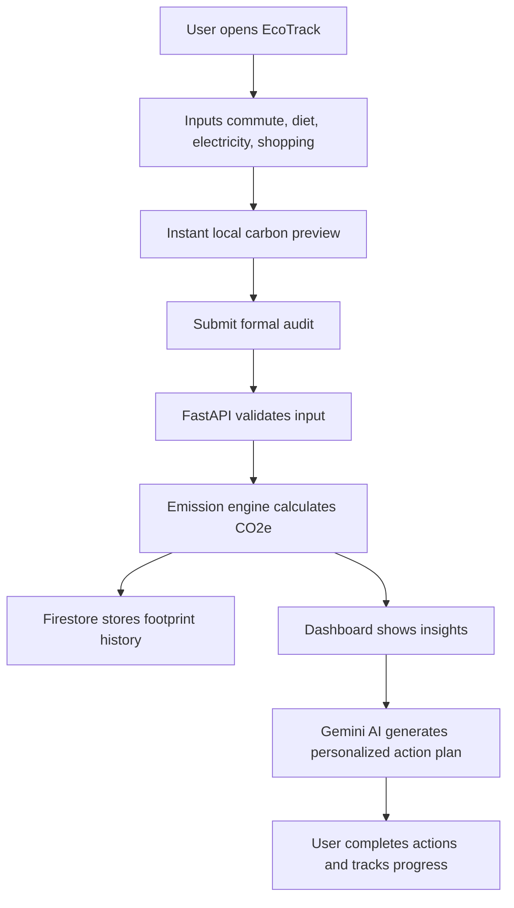

# 🌱 EcoTrack — AI Carbon Footprint Tracker

> **An AI-powered personal sustainability assistant that helps people understand, track, and reduce their carbon footprint through simple inputs, visual insights, and personalized climate action plans.**

<p align="center">
  
  
  
  
</p>

## 🏆 Competition Pitch

**EcoTrack turns climate awareness into daily action.**  
Most people want to live sustainably, but they do not know where to start, what matters most, or how much impact their choices actually create. EcoTrack solves this by combining a fast carbon footprint calculator, localized emission factors, AI-powered coaching, and progress tracking into one simple experience.

Instead of guilt-based messaging, EcoTrack uses **friendly, practical, and personalized guidance**. A user enters everyday activities such as commute, diet, electricity use, and shopping habits. The app instantly estimates their monthly carbon footprint, highlights the highest-impact category, and generates realistic action tasks using **Google Vertex AI Gemini**.

### Why this project can stand out to judges

| Judging Area | How EcoTrack Wins |
|---|---|
| **Impact** | Helps users reduce emissions through realistic, everyday actions. |
| **Innovation** | Combines carbon scoring, AI coaching, localized insights, and gamified progress. |
| **Technical Depth** | Uses React + Vite, FastAPI, Nginx, Google Cloud Run, Firestore, Vertex AI Gemini, Cloud Build, Logging, Monitoring, Trace, Scheduler, and Secret Manager. |
| **User Experience** | Simple form-first flow, instant preview, visual dashboard, and non-judgmental recommendations. |
| **Scalability** | Serverless architecture with Cloud Run and managed Google Cloud services. |
| **Responsible AI** | Uses safety filters, grounded prompts, and avoids shame-based climate messaging. |

---

## 📌 Chosen Vertical

**Personal Sustainability Assistant**

EcoTrack focuses on individual climate action by helping users:

- Measure their carbon footprint quickly
- Understand which lifestyle area causes the most emissions
- Receive AI-generated reduction advice
- Track progress over time
- Build sustainable habits through small achievable actions

---

## 🚨 Problem Statement

Climate change is a global crisis, but individual action often feels confusing and overwhelming. Many urban professionals and students want to reduce their environmental impact but struggle with three core problems:

1. **No clear starting point** — people do not know what to measure.
2. **No personalized guidance** — generic advice does not fit their lifestyle.
3. **No progress feedback** — users lose motivation when they cannot see improvement.

EcoTrack solves this by providing a **fast footprint audit**, **personalized AI recommendations**, and a **progress dashboard** that turns sustainability into a measurable habit.

---

## 💡 Solution Overview

EcoTrack is a web app where users enter a few weekly/monthly lifestyle details. The app calculates estimated emissions, stores the result, compares the user with baseline ranges, and provides action recommendations.

### Core user flow



---

## ✨ Key Features

### 1. Instant Carbon Footprint Audit
- Quick input form for transport, diet, electricity, and shopping
- Real-time CO2e preview before submission
- Monthly and yearly footprint estimate
- Highest-emission category detection

### 2. Personalized AI Sustainability Coach
- Powered by **Google Vertex AI Gemini**
- Gives realistic recommendations based on the user’s latest footprint
- Avoids guilt, fear, or unrealistic advice
- Suggests actions ranked by impact and difficulty

### 3. Visual Insights Dashboard
- Carbon score gauge
- Category-wise emission breakdown
- Monthly trend chart
- “Biggest improvement opportunity” highlight
- Action cards with estimated impact

### 4. Progress Tracking
- Stores historical footprint records in Firestore
- Tracks reduction over time
- Shows personal best and improvement percentage
- Supports weekly or monthly review

### 5. Gamified Habit Loop
- Eco score out of 100
- Streaks for repeated tracking
- Badges such as “Transit Hero”, “Energy Saver”, and “Low Waste Week”
- Weekly AI-generated challenge

### 6. Judge-Friendly Demo Mode
- App works with mock/in-memory mode if Google Cloud project ID is empty
- Makes judging and local testing easier
- Demo user data can be generated without authentication

---

## 🧠 AI Design

EcoTrack uses Gemini as a **sustainability coach**, not just a chatbot.

### AI responsibilities

| AI Task | Description |
|---|---|
| Personalized coaching | Suggests lifestyle changes based on user footprint categories. |
| Action ranking | Prioritizes recommendations by estimated carbon reduction. |
| Friendly explanation | Explains emissions in simple language. |
| Habit nudges | Generates weekly challenges and encouragement. |
| Safety-aware responses | Avoids guilt, fear, or extreme lifestyle instructions. |

### Example AI prompt strategy

```txt
You are EcoTrack Coach, a friendly sustainability assistant.
Use the user's latest carbon footprint data to suggest practical actions.
Rules:
- Be encouraging, not judgmental.
- Recommend 3 to 5 realistic actions.
- Prioritize high-impact categories first.
- Include estimated impact when possible.
- Do not use fear-based or guilt-based language.
- Keep advice simple enough for a beginner.
```

### AI provider

| Item | Value |
|---|---|
| Provider | Google Vertex AI Gemini |
| Primary model | Configurable through environment variable |
| Example model | `gemini-1.5-flash` |
| Authentication | IAM-based Google Cloud credentials |
| API keys | Not required |
| Safety | Harm category filters enabled |

---

## 🏗️ Architecture

This version uses a **React + Vite frontend** with a **FastAPI backend** behind an Nginx reverse proxy.

```txt
┌─────────────────────────────────────────────────────────────┐
│                        User Browser                         │
│       Carbon Form · Dashboard · AI Chat · Progress UI        │
└──────────────────────────────┬──────────────────────────────┘
                               │ HTTPS
                               ▼
┌─────────────────────────────────────────────────────────────┐
│                 Cloud Run Containerized App                  │
│                                                             │
│  ┌──────────────────────┐     ┌──────────────────────────┐  │
│  │ React + Vite UI     │     │ FastAPI Backend          │  │
│  │ frontend/src/*       │────▶│ /api/audit               │  │
│  │ Dashboard + Chat     │     │ /api/chat                │  │
│  │ Components           │     │ /api/history             │  │
│  └──────────────────────┘     └────────────┬─────────────┘  │
└────────────────────────────────────────────┼────────────────┘
                                             │
        ┌────────────────────────────────────┼────────────────────────────────────┐
        ▼                                    ▼                                    ▼
┌──────────────────┐              ┌────────────────────┐              ┌──────────────────┐
│ Firestore        │              │ Vertex AI Gemini   │              │ Cloud Operations │
│ footprint records│              │ AI coach responses │              │ logs/traces      │
│ chat history     │              │ action generation  │              │ metrics/alerts   │
└──────────────────┘              └────────────────────┘              └──────────────────┘
```

---

## ☁️ Google Cloud Services Used

| # | Service | Purpose in EcoTrack |
|---|---|---|
| 1 | **Cloud Run** | Hosts the containerized React + Vite frontend, FastAPI backend, and Nginx reverse proxy with autoscaling. |
| 2 | **Vertex AI Gemini** | Generates personalized sustainability coaching and action plans. |
| 3 | **Firestore** | Stores footprint records, session IDs, action history, and chat summaries. |
| 4 | **Artifact Registry** | Stores Docker images securely before Cloud Run deployment. |
| 5 | **Cloud Build** | Builds, tests, and deploys the project through CI/CD. |
| 6 | **Cloud Logging** | Captures structured server logs and request errors. |
| 7 | **Cloud Monitoring** | Tracks uptime, latency, error rate, and resource usage. |
| 8 | **Cloud Trace** | Measures API performance and identifies slow requests. |
| 9 | **Cloud Scheduler** | Triggers weekly footprint summary jobs and challenge refreshes. |
| 10 | **Secret Manager** | Stores production secrets and config securely. |

### Why this matters for competition

This project does not only use AI at the surface level. It demonstrates a complete cloud-native product with deployment, observability, secure authentication, scalable storage, and responsible AI design.

---

## 🧮 Emission Calculation Methodology

EcoTrack estimates emissions using simple, transparent factors. The methodology is intentionally explainable so users and judges can understand how scores are calculated.

### Formula

```txt
Total Monthly CO2e = Transport CO2e + Diet CO2e + Electricity CO2e + Shopping CO2e
Yearly CO2e = Total Monthly CO2e × 12
Eco Score = 100 - normalized impact penalty
```

### Default emission factors

| Category | Input | Factor / Monthly Baseline | Notes |
|---|---:|---:|---|
| Transport — Car | km/week | 0.21 kg CO2e/km | Average gasoline passenger car estimate. |
| Transport — Bus | km/week | 0.089 kg CO2e/km | Public transit estimate. |
| Transport — Train/Metro | km/week | 0.041 kg CO2e/km | Lower-carbon public transport estimate. |
| Transport — Flight | km/month | 0.255 kg CO2e/km | Short/medium-haul passenger estimate. |
| Diet — Vegan | monthly | 55 kg CO2e | Plant-based diet baseline. |
| Diet — Vegetarian | monthly | 85 kg CO2e | Dairy-inclusive vegetarian baseline. |
| Diet — Omnivore | monthly | 150 kg CO2e | Mixed diet baseline. |
| Diet — Meat-heavy | monthly | 230 kg CO2e | High red-meat consumption baseline. |
| Electricity | kWh/month | 0.82 kg CO2e/kWh | India grid-intensity baseline used for MVP. |
| Shopping — Low | monthly | 30 kg CO2e | Minimal purchasing baseline. |
| Shopping — Medium | monthly | 70 kg CO2e | Standard consumption baseline. |
| Shopping — High | monthly | 130 kg CO2e | High consumerism/fast-fashion baseline. |

> Note: Values are configurable in the backend emission engine and mirrored in the frontend preview logic, so the app can support region-specific calculations in future versions.

---

## 🧩 Recommended Project Structure

```txt
ecotrack/
├── frontend/
│   ├── src/
│   │   ├── components/
│   │   ├── pages/
│   │   ├── lib/
│   │   └── main.tsx
│   ├── package.json
│   └── vite.config.ts
├── backend/
│   ├── main.py
│   ├── routers/
│   │   ├── audit.py
│   │   ├── chat.py
│   │   ├── history.py
│   │   └── challenge.py
│   ├── services/
│   │   ├── carbon_calculator.py
│   │   ├── firestore_service.py
│   │   └── gemini_service.py
│   ├── models/
│   ├── tests/
│   └── requirements.txt
├── nginx.conf
├── docker-compose.yml
├── Dockerfile
├── cloudbuild.yaml
├── deploy/
│   └── setup-gcp.sh
└── README.md
```

---

## 🔌 API Routes

| Method | Route | Purpose |
|---|---|---|
| `POST` | `/api/audit` | Validate inputs, calculate footprint, store audit. |
| `POST` | `/api/chat` | Generate AI coaching response from Gemini. |
| `GET` | `/api/history` | Return previous footprint records for the session/user. |
| `POST` | `/api/challenge` | Generate or refresh weekly carbon reduction challenge. |
| `GET` | `/api/health` | Health check for Cloud Run and monitoring. |

### Example `/api/audit` request

```json
{
  "sessionId": "demo-user-123",
  "transport": {
    "mode": "car",
    "kmPerWeek": 120
  },
  "diet": "vegetarian",
  "electricityKwhPerMonth": 180,
  "shoppingLevel": "medium"
}
```

### Example response

```json
{
  "monthlyKgCO2e": 401.64,
  "yearlyKgCO2e": 4819.68,
  "score": 72,
  "highestCategory": "electricity",
  "breakdown": {
    "transport": 100.8,
    "diet": 85,
    "electricity": 147.6,
    "shopping": 70
  },
  "topActions": [
    "Shift 2 commute days to public transport",
    "Reduce electricity use by 10% this month",
    "Choose one no-buy week for non-essential shopping"
  ]
}
```

---

## 🗃️ Firestore Data Model

```txt
footprints/{recordId}
├── sessionId: string
├── createdAt: timestamp
├── monthlyKgCO2e: number
├── yearlyKgCO2e: number
├── score: number
├── highestCategory: string
├── inputs: object
├── breakdown: object
└── actions: array

chats/{chatId}
├── sessionId: string
├── createdAt: timestamp
├── userMessage: string
├── aiResponse: string
└── footprintContext: object

challenges/{challengeId}
├── sessionId: string
├── weekStart: timestamp
├── title: string
├── estimatedImpactKg: number
└── completed: boolean
```

---

## 🚀 Local Development

### 1. Clone the repository

```bash
git clone https://github.com/YOUR_USERNAME/ecotrack.git
cd ecotrack
```

### 2. Create environment file

```bash
cp .env.example .env
```

Update `.env` with your Google Cloud project ID. If `GOOGLE_CLOUD_PROJECT` is empty, the backend should run in demo/mock mode so judges can test the app without cloud credentials.

```env
# Google Cloud
GOOGLE_CLOUD_PROJECT="your-gcp-project-id"
VERTEX_AI_LOCATION="asia-south1"
GEMINI_MODEL="gemini-1.5-flash"
FIRESTORE_COLLECTION="footprints"

# Frontend
VITE_APP_NAME="EcoTrack"
VITE_DEMO_MODE="true"
VITE_API_BASE_URL="/api"

# Security controls
AI_CHAT_RATE_LIMIT_PER_MINUTE="10"
GLOBAL_RATE_LIMIT_PER_MINUTE="60"
```

### 3. Authenticate Google Cloud locally

```bash
gcloud auth application-default login
```

This is required only when you want to test Vertex AI Gemini or Firestore locally.

### 4. Run everything with Docker Compose

```bash
docker compose up --build
```

Open the app at:

```txt
http://localhost:8080
```

The Docker setup should run:

- React + Vite frontend
- FastAPI backend
- Nginx reverse proxy
- `/api/*` routing from frontend to backend

### 5. Run frontend and backend separately

Use this mode for faster development.

```bash
# Backend
cd backend
python -m venv venv
source venv/bin/activate  # Windows PowerShell: .\venv\Scripts\Activate.ps1
pip install -r requirements.txt
uvicorn main:app --host 127.0.0.1 --port 8000 --reload
```

```bash
# Frontend
cd frontend
npm install
npm run dev
```

Open:

```txt
Frontend: http://localhost:5173
Backend API: http://localhost:8000
```

---

## 🧪 Running Tests

### Next.js App Tests

```bash
npm install
npm run test
```

Recommended coverage:

| Test Area | What to Validate |
|---|---|
| Carbon calculator | Correct CO2e totals, score boundaries, and highest-category detection. |
| Input validation | Reject negative values, missing fields, unrealistic ranges, and unsafe payloads. |
| FastAPI endpoints | Correct status codes, response shape, error handling, and request IDs. |
| Gemini prompt | Safe tone, no private data leakage, and advice grounded in footprint context. |
| Firestore layer | Mock storage works when Google Cloud config is missing. |
| UI components | Dashboard renders correct category breakdown, charts, and action cards. |

---

## 🐳 Docker

### Build locally

```bash
docker build -t ecotrack .
```

### Run locally

```bash
docker run -p 8080:8080 --env-file .env ecotrack
```

Open:

```txt
http://localhost:8080
```

### Recommended container behavior

- Nginx listens on port `8080`
- Nginx serves the production React build
- Nginx proxies `/api/*` requests to FastAPI on port `8000`
- Cloud Run receives traffic on port `8080`

---

## ☁️ Deploy to Google Cloud Run

### One-command setup

You can deploy the Next.js app directly to Cloud Run using source deployment:

```bash
gcloud run deploy ecotrack --source . --region asia-south1 --allow-unauthenticated
```

Ensure you have the `GEMINI_API_KEY` configured in the Cloud Run service environment variables.

---

## 🔁 CI/CD with Cloud Build

Example `cloudbuild.yaml` flow:

```yaml
steps:
  - name: python:3.11
    entrypoint: bash
    args:
      - -c
      - |
        cd backend
        pip install -r requirements.txt
        pytest tests/ -v

  - name: node:20
    entrypoint: bash
    args:
      - -c
      - |
        cd frontend
        npm ci
        npm run test
        npm run build

  - name: gcr.io/cloud-builders/docker
    args:
      - build
      - -t
      - asia-south1-docker.pkg.dev/$PROJECT_ID/ecotrack/app:$COMMIT_SHA
      - .

  - name: gcr.io/cloud-builders/docker
    args:
      - push
      - asia-south1-docker.pkg.dev/$PROJECT_ID/ecotrack/app:$COMMIT_SHA

  - name: gcr.io/google.com/cloudsdktool/cloud-sdk
    entrypoint: gcloud
    args:
      - run
      - deploy
      - ecotrack
      - --image=asia-south1-docker.pkg.dev/$PROJECT_ID/ecotrack/app:$COMMIT_SHA
      - --region=asia-south1
      - --platform=managed
      - --allow-unauthenticated
```

---

## 🔐 Security and Responsible AI

| Area | Implementation |
|---|---|
| Authentication | Uses Google Cloud IAM for Vertex AI and Firestore. |
| API keys | No third-party AI keys required. |
| Input safety | Server-side validation for all audit and chat payloads. |
| Rate limiting | Separate limits for global API and AI chat endpoint. |
| Error handling | Sanitized browser responses with detailed server logs. |
| Prompt safety | Gemini receives only relevant footprint context. |
| Data minimization | MVP uses anonymous session IDs instead of collecting personal identity. |
| Secrets | Secret Manager for production secrets. |
| AI tone | Friendly, practical, non-judgmental, and beginner-safe. |

---

## 📊 Observability

EcoTrack is designed to be demo-ready and production-ready.

| Tool | What it tracks |
|---|---|
| Cloud Logging | API errors, request IDs, Gemini failures, audit creation. |
| Cloud Monitoring | Latency, uptime, CPU, memory, request count. |
| Cloud Trace | Slow API route analysis. |
| Cloud Scheduler | Weekly challenge generation and analytics aggregation. |

Suggested metrics for dashboard:

- Total audits completed
- Average footprint score
- Most common high-emission category
- Average AI response latency
- Weekly active users
- Estimated total CO2e reduction committed by users

---

## 🎬 Demo Script for Judges

Use this 2-minute flow during the competition demo:

1. **Open landing page**  
   Show the clean mission: “Track your footprint. Reduce it with AI.”

2. **Enter lifestyle data**  
   Add commute, diet, electricity, and shopping values.

3. **Show instant preview**  
   Explain that users understand impact before submitting.

4. **Submit audit**  
   Show the dashboard with monthly CO2e, yearly CO2e, score, and biggest category.

5. **Open AI coach**  
   Ask: “How can I reduce my footprint this week without spending money?”

6. **Show personalized plan**  
   Highlight that the AI uses the user’s latest footprint context.

7. **Show progress/history**  
   Demonstrate how repeated audits build motivation over time.

8. **End with impact**  
   “EcoTrack makes climate action measurable, personal, and achievable.”

---

## 🏅 Competitive Advantages

### 1. Practical impact, not just awareness
EcoTrack does not stop at showing numbers. It converts emissions into clear action tasks.

### 2. AI with purpose
Gemini is used for personalized sustainability coaching, not as a generic chatbot.

### 3. Cloud-native implementation
The project uses Google Cloud services across hosting, AI, database, CI/CD, security, monitoring, and scheduling.

### 4. Beginner-friendly UX
The user does not need climate knowledge to start. The form is simple, and the insights are visual.

### 5. Responsible sustainability tone
The app avoids guilt-based climate messaging and encourages progress over perfection.

### 6. Expandable product vision
The MVP can grow into team challenges, city-level insights, receipt scanning, smart meter integration, and green rewards.

---

## 🧭 Product Roadmap

### Phase 1 — MVP
- Carbon input form
- Local emission calculator
- Dashboard with breakdown
- Mock data mode
- Basic AI coach

### Phase 2 — Cloud Integration
- Firestore storage
- Vertex AI Gemini integration
- Cloud Run deployment
- Cloud Logging and Monitoring
- Secure IAM setup

### Phase 3 — Competition Polish
- Gamified badges
- Weekly challenge cards
- Demo mode
- Better empty states
- Mobile-first UI
- Judge demo script in README

### Phase 4 — Advanced Innovation
- OCR receipt scanning for shopping footprint
- Google Maps commute estimation
- Smart meter electricity import
- Community leaderboard
- School/college sustainability campaigns
- Carbon reduction certificate generation

---

## 📱 UI Pages

| Page | Purpose |
|---|---|
| `/` | Landing page and first audit form. |
| `/dashboard` | Footprint summary, charts, action cards, and history. |
| `/coach` | Gemini-powered sustainability chat. |
| `/progress` | Trends, badges, streaks, and completed challenges. |
| `/about` | Methodology and project impact explanation. |

---

## ✅ Implementation Checklist

### Must-have before submission

- [x] Replace the starter README with this competition-ready project README
- [ ] Add screenshots or GIF demo
- [ ] Add live Cloud Run URL
- [x] Add working `/api/audit` endpoint
- [x] Add working carbon calculator
- [x] Add Gemini coach endpoint
- [x] Add Firestore persistence
- [x] Add demo mode fallback
- [x] Add dashboard charts
- [x] Add error states and loading states
- [x] Add Cloud Run deployment instructions
- [x] Add testing instructions

### Nice-to-have for extra points

- [x] Weekly AI challenge
- [x] Badge system
- [x] Shareable progress card
- [x] Admin analytics page
- [x] Multi-region emission factors
- [ ] Accessibility audit
- [ ] Lighthouse score screenshot

---

## 🧾 Environment Variables

| Variable | Required | Description | Default |
|---|---|---|---|
| `GOOGLE_CLOUD_PROJECT` | No for demo, yes for production | Google Cloud project ID. | Empty = mock mode |
| `VERTEX_AI_LOCATION` | No | Vertex AI region. | `asia-south1` |
| `GEMINI_MODEL` | No | Gemini model name. | `gemini-1.5-flash` |
| `FIRESTORE_COLLECTION` | No | Collection for footprint records. | `footprints` |
| `VITE_APP_NAME` | No | Public app display name. | `EcoTrack` |
| `VITE_DEMO_MODE` | No | Enables demo-friendly UI behavior. | `true` |
| `AI_CHAT_RATE_LIMIT_PER_MINUTE` | No | AI chat endpoint limit. | `10` |
| `GLOBAL_RATE_LIMIT_PER_MINUTE` | No | General endpoint limit. | `60` |

---

## 🧠 What Makes EcoTrack Different

Most carbon calculators only provide a number. EcoTrack provides a **path forward**.

```txt
Traditional calculator:
Input → CO2 number → User leaves

EcoTrack:
Input → CO2 insight → AI action plan → Progress tracking → Habit formation
```

This makes EcoTrack more useful for real people and more impressive as a competition project.

---

## 📸 Screenshots

Add screenshots before final submission:

```txt
/public/screenshots/landing.png
/public/screenshots/audit-form.png
/public/screenshots/dashboard.png
/public/screenshots/ai-coach.png
/public/screenshots/progress.png
```

Recommended README layout:

```md


```

---

## 🧑‍💻 Built With

- **React + Vite** — Fast frontend experience
- **FastAPI** — High-performance Python API backend
- **TypeScript** — Safer frontend logic
- **Tailwind CSS** — Fast and responsive UI styling
- **Google Cloud Run** — Serverless hosting
- **Vertex AI Gemini** — AI sustainability coach
- **Firestore** — Cloud database
- **Cloud Build** — CI/CD pipeline
- **Cloud Logging, Monitoring, Trace** — Observability
- **Secret Manager** — Secure production configuration

---

## 🌍 Impact Vision

EcoTrack aims to make sustainability feel achievable. If users can identify one high-impact habit, commit to one weekly challenge, and see measurable improvement, the app can turn climate action from a confusing topic into a daily routine.

> **Mission:** Help every individual make smarter choices for the planet without feeling overwhelmed.

---

## 📄 License

This project is created for educational and competition purposes. Add your final license before public release.

---

## 🙌 Acknowledgements

Built for a sustainability-focused innovation challenge using Google Cloud and Vertex AI Gemini.

---

## ⭐ Final Competition Message

EcoTrack is not just a carbon calculator. It is a personal climate companion that combines measurable impact, responsible AI, and scalable cloud architecture to help users build sustainable habits one action at a time.
